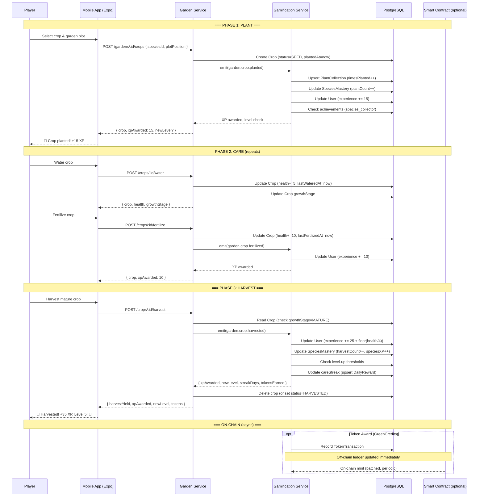
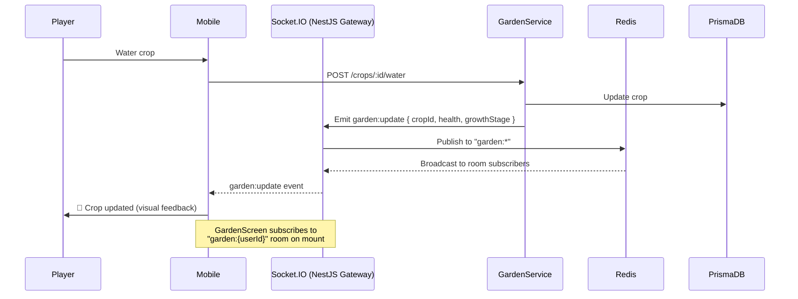
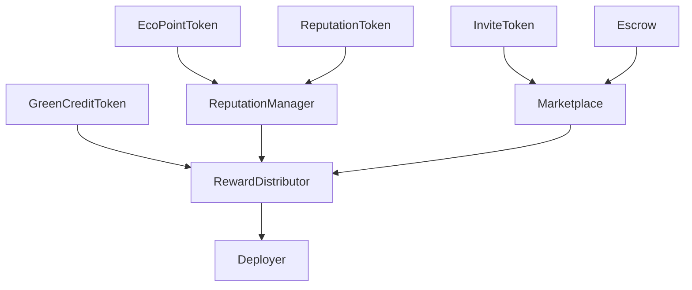
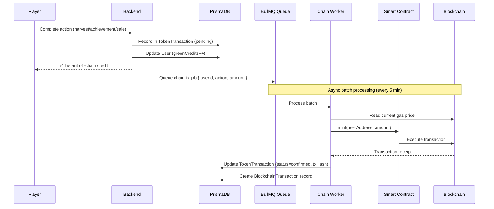
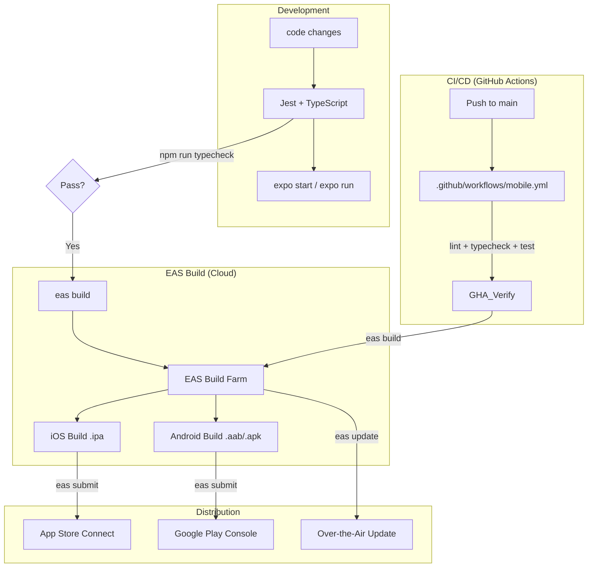

# Gamification & Contract Architecture

> **Purpose**: End-to-end documentation of the gamification system, smart contract integration, game UI data flow, and mobile app publishing.
> **Last updated**: 2026-06-01

---

## Architecture Overview

```
┌─────────────────────────────────────────────────────────────────────┐
│                        PLAYER EXPERIENCE                              │
│                                                                      │
│  ┌─────────────────────┐        ┌────────────────────────────────┐  │
│  │  Mobile App (Expo)  │        │  Admin Dashboard (Next.js)     │  │
│  │                     │        │                                │  │
│  │  GardenScreen       │        │  /gamification page            │  │
│  │  ProfileScreen      │        │  Species catalog               │  │
│  │  AchievementsScreen │        │  Mastery tables                │  │
│  │  InventoryScreen    │        │  Achievement tracking          │  │
│  │  MarketScreen       │        │  Level distribution charts     │  │
│  └──────────┬──────────┘        └────────────┬───────────────────┘  │
│             │                                │                       │
└─────────────┼────────────────────────────────┼───────────────────────┘
              │                                │
              ▼                                ▼
┌──────────────────────────────────────────────────────────────────────┐
│                    BACKEND (Next.js API Routes)                       │
│                                                                      │
│  ┌─────────────┐  ┌──────────────┐  ┌─────────────┐                 │
│  │Gamification │  │ Garden       │  │ Marketplace │                 │
│  │ Service     │  │ Service      │  │ Service     │                 │
│  │             │  │              │  │             │                 │
│  │ - XP/Levels │  │ - Crops      │  │ - Listings  │                 │
│  │ - Mastery   │  │ - Planting   │  │ - Escrow    │                 │
│  │ - Collections│  │ - Growth     │  │ - Payments  │                 │
│  │ - Hybrids   │  │ - Harvest    │  │             │                 │
│  │ - Achieve.  │  │              │  │             │                 │
│  │ - Streaks   │  │              │  │             │                 │
│  └──────┬──────┘  └──────┬───────┘  └──────┬──────┘                 │
│         │                │                  │                        │
│         ▼                ▼                  ▼                        │
│  ┌──────────────────────────────────────────────────────────────┐   │
│  │                    PostgreSQL (Supabase)                       │   │
│  │  Users | PlantSpecies | Collections | Mastery | Achievements  │   │
│  │  Crops | Gardens | ShopItems | Purchases | TokenTransactions  │   │
│  │  BlockChainTransactions (off-chain ledger)                    │   │
│  └──────────────────────────────────────────────────────────────┘   │
└──────────────────────────────────────────────────────────────────────┘
                              │
                              ▼
┌──────────────────────────────────────────────────────────────────────┐
│                    SMART CONTRACTS (Ethereum/Sepolia)                  │
│                                                                      │
│  ┌──────────────┐  ┌──────────────┐  ┌────────────────────────┐     │
│  │GreenCredit   │  │EcoPointToken │  │ReputationToken (ERC721)│     │
│  │Token (ERC20) │  │(ERC20 soulbd)│  │ 5 badge levels         │     │
│  │with Permit   │  │non-transfer  │  │ Bronze → Diamond       │     │
│  ├──────────────┤  ├──────────────┤  ├────────────────────────┤     │
│  │Marketplace   │  │Escrow        │  │ReputationManager       │     │
│  │2% platform   │  │7-day timeout │  │5 ranks: Newcomer→GM    │     │
│  │fee           │  │disputes      │  │Score-based             │     │
│  ├──────────────┤  ├──────────────┤  ├────────────────────────┤     │
│  │InviteToken   │  │RewardDistrib │  │                        │     │
│  │(ERC721 soul) │  │Merkle-tree   │  │                        │     │
│  │Admin-issued  │  │claims        │  │                        │     │
│  └──────────────┘  └──────────────┘  └────────────────────────┘     │
└──────────────────────────────────────────────────────────────────────┘
```

---

## 1. Gamification Data Model

### Core Concepts

| Concept | Storage | Description |
|---------|---------|-------------|
| **Level** | `User.level` (Int) | 1-based, scales `newLevel * 100` XP per level |
| **Experience (XP)** | `User.experience` (Int) | Total lifetime XP from all actions |
| **Green Credits** | `User.greenCredits` (Float) | Spendable in-game currency (earned + purchased) |
| **Eco Points** | `User.ecoPoints` (Float) | Soulbound environmental points |
| **Sustainability Score** | `User.sustainabilityScore` (Float) | 0-100 green practices score |
| **Care Streak** | `User.currentStreak` (Int) | Consecutive days of garden care |
| **Species Collection** | `PlantCollection` | Per-user, per-species planted count |
| **Species Mastery** | `SpeciesMastery` | Per-species level 1-10 with XP |
| **Plant Hybrids** | `PlantHybrid` | Cross-bred species with 2 parents |
| **Achievements** | `Achievement` + `UserAchievement` | 10 seeded achievements |
| **Shop Items** | `ShopItem` + `UserPurchase` | Items purchasable with green credits |
| **Inventory** | `Inventory` | Items with rarity (COMMON→LEGENDARY) |
| **Energy** | `UserEnergy` | Regen-based action energy (5/hr) |
| **Daily Rewards** | `DailyReward` | Per-day claim tracking |

### XP Reward Table

| Action | Base XP | Notes |
|--------|---------|-------|
| Plant a crop | 15 | — |
| Water a crop | 5 | — |
| Fertilize a crop | 10 | — |
| Harvest a crop | 25 + floor(health/4) | Scales with crop health |
| Discover a species | 50 | First time planting a species |
| Create a hybrid | 100 | Cross-pollinate 2 species |
| Perfect a species | 200 | Reach mastery level 10 |
| Daily login | varies | Streak-dependent |

### Care Streak Bonuses

| Streak | Label | Health Bonus | XP Multiplier | Token Reward |
|--------|-------|-------------|---------------|--------------|
| 3 days | 🔥 3-day | +5 | 1× | — |
| 7 days | 🔥 7-day | +15 | 1.5× | — |
| 14 days | 🔥 14-day | +30 | 2.0× | — |
| 30 days | 🔥 30-day | +50 | 3.0× | 100 |

### Mastery System

10 levels per species, each requiring cumulative XP:

| Level | XP Required | Reward |
|-------|-------------|--------|
| 1 | 0 | Unlock species |
| 2 | 100 | — |
| 3 | 250 | Achievement: Species Apprentice (3 species) |
| 4 | 500 | — |
| 5 | 1000 | — |
| 6 | 2000 | — |
| 7 | 3500 | Achievement: Master Botanist (7 species) |
| 8 | 5500 | — |
| 9 | 8000 | — |
| 10 | 11000 | Perfected (set `perfectedAt`) + 200 XP |

---

## 2. Complete Player Action Flow

### Example: Plant → Grow → Harvest Cycle



### WebSocket Real-time Updates



---

## 3. Smart Contract Integration

### Hybrid Architecture: Off-chain + On-chain

GardenVerse uses a **two-tier ledger** system:

1. **Off-chain (PostgreSQL):** Real-time gamification state. All XP, levels, collections, mastery, achievements happen in the database with instant visibility.
2. **On-chain (Ethereum/Sepolia):** Tokenized assets with real economic value. GreenCredits, EcoPoints, ReputationBadges, Marketplace trades use smart contracts.

### Contract Deployment Dependencies



### Token Mapping

| Token | Contract | Type | Transferable | Minted By | Use Case |
|-------|----------|------|-------------|-----------|----------|
| Green Credits | `GreenCreditToken` | ERC20 with Permit | ✅ Yes | Owner role | Shop purchases, marketplace |
| Eco Points | `EcoPointToken` | ERC20 | ❌ No (soulbound) | `REPUTATION_CONTRACT` role | Environmental score |
| Reputation | `ReputationToken` | ERC721 | ❌ No (soulbound) | `MINTER_ROLE` | Badge NFTs (5 levels) |
| Invite | `InviteToken` | ERC721 | ❌ No (soulbound) | Admin | Invite system |

### Reputation Ranks

| Rank | Score Range | Badge Level |
|------|-------------|-------------|
| Newcomer 🌱 | 0-99 | Bronze |
| Gardener 🧑‍🌾 | 100-499 | Silver |
| Horticulturist 🌿 | 500-999 | Gold |
| Master Gardener 🏆 | 1,000-4,999 | Platinum |
| Grandmaster 👑 | 5,000+ | Diamond |

### On-chain Action Flow



---

## 4. Mobile Game UI Rendering

### Screen Hierarchy

```
App (_layout.tsx)
├── (auth) ─── Login, Register, ForgotPassword, OTPVerify, Support
└── (tabs)
    ├── Garden (🌱 tab)
    │   ├── GardenScreen         ← Main game view
    │   │   ├── IsometricGrid    ← SVG isometric plot grid
    │   │   ├── CropSprite/SVG   ← Per-crop animated sprites
    │   │   ├── LevelProgress    ← XP bar + level badge
    │   │   ├── StreakBadge      ← Care streak indicator
    │   │   ├── GardenStats      ← Stats panel
    │   │   └── AnimatedActionButton ← Water/Fertilize/Harvest
    │   ├── GardenMapScreen      ← Google Maps garden overview
    │   ├── CropDetailScreen     ← Per-crop growth detail
    │   ├── PlantBrowserScreen   ← Species catalog (26+ species)
    │   └── PlantCropScreen      ← Plot selection for planting
    │
    ├── Market (🏪 tab)
    │   ├── MarketplaceScreen    ← Listing feed with filters
    │   ├── CreateListingScreen  ← New listing form
    │   └── ListingDetailScreen  ← Single listing + purchase
    │
    ├── Scan (📷 tab)
    │   └── AiScannerScreen      ← Camera + AI diagnosis
    │
    ├── Community (👥 tab)
    │   ├── CommunityScreen      ← Feed + nearby gardeners
    │   ├── ChatScreen           ← Encrypted messaging
    │   └── GroupDetailScreen    ← Group management
    │
    └── Profile (👤 tab)
        ├── ProfileScreen        ← User stats + level + credits
        ├── AchievementsScreen   ← 8 achievements with progress
        ├── InventoryScreen      ← Items by category tabs
        └── SettingsScreen       ← App settings
```

### Gamification Data Flow per Screen

```mermaid
graph TD
    subgraph "Mobile App"
        GS[GardenScreen]
        PS[ProfileScreen]
        AS[AchievementsScreen]
        IS[InventoryScreen]
    end
    
    subgraph "Services Layer"
        GSvc[gamification.ts service]
        ASvc[auth.ts service]
        WS[websocket.ts Socket.IO]
    end
    
    subgraph "State (Zustand)"
        AuthStore[authStore]
        GardenStore[gardenStore]
    end
    
    subgraph "Backend"
        GAPI[Gamification API]
        GdnAPI[Garden API]
        WSEvt[WebSocket Gateway]
    end
    
    subgraph "Database"
        PG[(PostgreSQL)]
    end

    GS -->|mount| GSvc
    GSvc -->|GET /gamification| GAPI
    GAPI --> PG
    PG -->|level, xp, credits, collections, masteries| GSvc
    GSvc --> GS
    
    GS -->|action: water| GardenStore
    GardenStore -->|POST /crops/:id/water| GdnAPI
    GdnAPI -->|update + emit event| PG
    GdnAPI -->|socket event| WSEvt
    WSEvt -->|garden:update| WS
    WS -->|real-time push| GS
    
    PS -->|mount| AuthStore
    AuthStore -->|user.level, xp, credits| PS
    
    AS -->|mount| GSvc
    GSvc -->|GET /gamification/achievements| GAPI
    GAPI -->|achievements[]| AS
    
    IS -->|mount| GSvc
```

### Component: Isometric Grid (Game Board)

The `IsometricGrid` component renders the garden as an SVG isometric tile grid:

```
┌─────────────────────────────────────┐
│   ⬗ ⬗ ⬗ ⬗ ⬗ ⬗                     │
│  ⬗ 🌱⬗ 🌻⬗ 🌽⬗                    │   ← Soil quality determines color
│ ⬗ 🟫⬗ 🟫⬗ 🟫⬗                     │   ← Each tile has: crop sprite + status dot
│  ⬗ ⬗⬗ ⬗ ⬗ ⬗                      │   ← Blue dot = watered, green = fertilized
│ ⬗ 🌸⬗ ⬗ ⬗ ⬗                       │   ← Animated spring on state change
│  ⬗ ⬗ ⬗ ⬗ ⬗ ⬗                     │
└─────────────────────────────────────┘
```

**Props:** `tiles[]` with `{ row, col, crop?, soilQuality, irrigation, status }`
**States:** loading (skeleton grid), empty (no crops planted), error (retry button), populated (crops with sprites)

### Crop Sprite Rendering

Each crop has **5 growth stages** rendered via `CropSpriteSVG`:

| Stage | Visual | Emoji Fallback |
|-------|--------|---------------|
| SEED | Small mound with seed dot | 🌰 |
| SPROUTING | Green stem with 2 leaves | 🌱 |
| GROWING | Full plant with buds | 🌿 |
| MATURE | Ripe fruit/vegetable | 🍅/🌻/🌽 |
| HARVESTED | Stubble | ✂️ |
| WILTED | Brown drooping | 🥀 |
| DISEASED | Spotted leaves | 🍂 |

---

## 5. Mobile App Publishing (EAS Build)

### Publishing Flow



### Prerequisites

| Requirement | Details |
|-------------|---------|
| **Apple Developer** | $99/yr — iOS certificates, App Store distribution |
| **Google Play** | $25 one-time — Android signing, Play Store |
| **Expo Account** | Free — EAS Build minutes, project management |
| **EAS CLI** | `npm install -g eas-cli` |

### Step 1: Install EAS CLI & Login

```bash
npm install -g eas-cli
eas login
eas whoami  # Verify
```

### Step 2: Create EAS Project

```bash
cd packages/mobile
eas init  # Creates project on expo.dev, returns projectId
```

Update `app.json` with the returned project ID:

```json
"extra": {
  "apiUrl": "https://api.gardenverse.app",
  "wsUrl": "wss://ws.gardenverse.app",
  "eas": { "projectId": "your-actual-project-id" }
}
```

### Step 3: Configure App Profiles

Create `packages/mobile/eas.json`:

```json
{
  "cli": {
    "version": ">= 8.0.0"
  },
  "build": {
    "development": {
      "developmentClient": true,
      "distribution": "internal",
      "ios": { "simulator": true },
      "android": { "buildType": "apk" }
    },
    "preview": {
      "distribution": "internal",
      "ios": { "simulator": false },
      "channel": "preview"
    },
    "production": {
      "channel": "production",
      "ios": {
        "image": "latest",
        "enterpriseProvisioning": "universal"
      },
      "android": {
        "buildType": "app-bundle"
      }
    }
  },
  "submit": {
    "production": {
      "ios": {
        "appleId": "your-apple-id@email.com",
        "ascAppId": "123456789",
        "appleTeamId": "TEAMID123"
      },
      "android": {
        "track": "production",
        "releaseStatus": "completed"
      }
    }
  }
}
```

### Step 4: Build for Development

```bash
eas build --profile development --platform all
```
Installs on device via QR code. Supports hot reload. Used for internal testing.

### Step 5: Build for Production

```bash
# iOS (requires Apple Developer cert + provisioning profile)
eas build --profile production --platform ios

# Android (auto-manages keystore)
eas build --profile production --platform android

# Both
eas build --profile production --platform all
```

EAS auto-manages:
- iOS certificates (or use your own with `"credentialsSource": "local"`)
- Android keystore generation
- Version bumping (`"autoIncrement": "version"` in build profile)

### Step 6: Submit to App Stores

```bash
# iOS (uploads to App Store Connect)
eas submit --platform ios

# Android (uploads to Google Play Console)
eas submit --platform android
```

### EAS Workflows (CI/CD via Expo)

EAS Workflows wrap the build/publish process in YAML files at `.eas/workflows/`. Three workflows are configured:

| File | Trigger | Action |
|------|---------|--------|
| `build.yml` | Push to main, PR, or manual | Lint → Production build (main) or Dev build (manual) |
| `dev-build.yml` | Manual only | Development APK/IPA |
| `ota-update.yml` | Push to main (JS changes) | Lint → OTA update to production channel |

These complement the GitHub Actions workflows in `.github/workflows/mobile.yml` for lint/typecheck/test on every PR.

Run locally to test:
```bash
cd packages/mobile
eas workflow:run build.yml       # Run the build workflow
eas workflow:run dev-build.yml   # Run dev build
```

Or trigger via the EAS dashboard at https://expo.dev/accounts/luckyhegdedev/projects/gardenverse/workflows

### Step 7: Over-the-Air Updates

For non-native changes (JS bundle, assets), skip app store review:

```bash
eas update --channel production --message "Fix crop watering animation"
```

Channel routing is controlled in `eas.json`:
- `production` channel → production build users
- `preview` channel → internal testers
- `staging` channel → QA team

### Environment Variables in Builds

Set secrets once; they're injected during EAS Build:

```bash
eas secret:create --name SENTRY_DSN --value "https://..."
eas secret:create --name GOOGLE_MAPS_API_KEY --value "AIza..."
eas secret:create --name API_URL --value "https://api.gardenverse.app"
```

Referenced in `app.json`:

```json
"extra": {
  "apiUrl": process.env.API_URL || "https://api.gardenverse.app",
  "wsUrl": process.env.WS_URL || "wss://ws.gardenverse.app"
}
```

### CI/CD via GitHub Actions

The existing `.github/workflows/mobile.yml` handles:

| Job | When | What |
|-----|------|------|
| `lint` | Every PR/push | ESLint check |
| `typecheck` | Every PR/push | TypeScript strict check |
| `test` | Every PR/push | Jest unit tests |
| `eas-build` | Main branch only | Build iOS + Android via EAS |

To add auto-submit after successful build, extend the workflow:

```yaml
eas-submit:
  needs: eas-build
  if: github.ref == 'refs/heads/main' && github.event_name == 'push'
  runs-on: ubuntu-latest
  steps:
    - uses: actions/checkout@v4
    - run: npx eas submit --platform ios --non-interactive
      env:
        EXPO_TOKEN: ${{ secrets.EXPO_TOKEN }}
```

### Build Artifact Comparison

| Profile | iOS | Android | Use Case |
|---------|-----|---------|----------|
| `development` | Simulator .app | APK | Development testing |
| `preview` | Ad-hoc .ipa (internal) | APK | QA / internal testers |
| `production` | App Store .ipa | AAB (Play Store) | Public release |

---

## 6. Quick Reference

### Gamification Endpoints (Backend)

| Method | Path | Purpose |
|--------|------|---------|
| GET | `/gamification` | Full gamification data |
| GET | `/gamification/collections` | Plant collections |
| GET | `/gamification/collections/stats` | Collection completion stats |
| POST | `/gamification/species/:id/discover` | Discover species |
| GET | `/gamification/mastery/:speciesId` | Species mastery |
| GET | `/gamification/masteries` | All masteries |
| POST | `/gamification/hybrid` | Create hybrid |
| GET | `/gamification/hybrids` | User hybrids |
| POST | `/gamification/crop/:id/care` | Update care streak |
| GET | `/gamification/achievements` | All achievements |
| POST | `/gamification/xp` | Award XP (admin) |

### Smart Contract Addresses (Hardhat Deploy)

| Contract | File | Dependencies |
|----------|------|-------------|
| `GreenCreditToken` | `contracts/tokens/GreenCreditToken.sol` | None |
| `EcoPointToken` | `contracts/tokens/EcoPointToken.sol` | None |
| `ReputationToken` | `contracts/tokens/ReputationToken.sol` | None |
| `InviteToken` | `contracts/tokens/InviteToken.sol` | None |
| `Escrow` | `contracts/marketplace/Escrow.sol` | None |
| `Marketplace` | `contracts/marketplace/Marketplace.sol` | Escrow |
| `ReputationManager` | `contracts/reputation/ReputationManager.sol` | EcoPointToken |
| `RewardDistributor` | `contracts/reputation/RewardDistributor.sol` | GreenCreditToken |

### Deploy Command

```bash
cd contracts
npx hardhat run scripts/deploy.js --network <network>
# Networks: hardhat, localhost, sepolia, mainnet
```

Run tests:

```bash
npx hardhat test  # 41 tests total
npx hardhat size-contracts
```

### Mobile Build Commands

```bash
# Development
npm run mobile:dev          # expo start (dev server)
cd packages/mobile && npx expo run:ios    # Native build on device
cd packages/mobile && npx expo run:android # Native build on device

# Production (via EAS)
cd packages/mobile
eas build --profile production --platform all
eas submit --platform all
eas update --channel production --message "Description"
```

### Seed Data Reference

| Entity | Count | Details |
|--------|-------|---------|
| Users | 10 | Levels 1-50, varied XP/credits |
| Plant Species | 26 | OpenFarm-sourced, 4 difficulties |
| Crops | Per user | Various growth stages |
| Achievements | 10 | Species collector → Harvest legend |
| Shop Items | 10 | Seeds, fertilizers, tools, decor |
| Inventory Items | 12 | 5 rarity tiers |
| Feature Flags | 6 | `gamification_v2` enabled |

---

## 7. Troubleshooting

### Gamification Data Not Updating

1. Check `GamificationService` logs for errors
2. Verify `gamification_v2` feature flag is enabled
3. Check `TokenTransaction` records for pending chain operations

### Mobile Build Fails

1. `eas build:list` — Check build logs on expo.dev
2. Verify `app.json` has correct `eas.projectId`
3. Ensure all secrets are set: `eas secret:list`
4. For iOS: check Apple Developer membership is active

### Contract Deployment Issues

1. Verify `.env` has `PRIVATE_KEY` and `INFURA_API_KEY` (or `ALCHEMY_API_KEY`)
2. Check network RPC status: `npx hardhat console --network sepolia`
3. Ensure sufficient ETH for gas on the target network

### Missing Mobile Screen

1. Verify file exists in `packages/mobile/src/screens/`
2. Check Expo Router file exists in `packages/mobile/app/`
3. Run `npx expo export --platform web` to catch route errors
