# Sequence Diagrams — GardenVerse Workflows & Service Calls

> Top-level Mermaid sequence diagrams documenting key user workflows, feature interactions, and cross-service communication patterns.

---

## 1. User Onboarding & Authentication

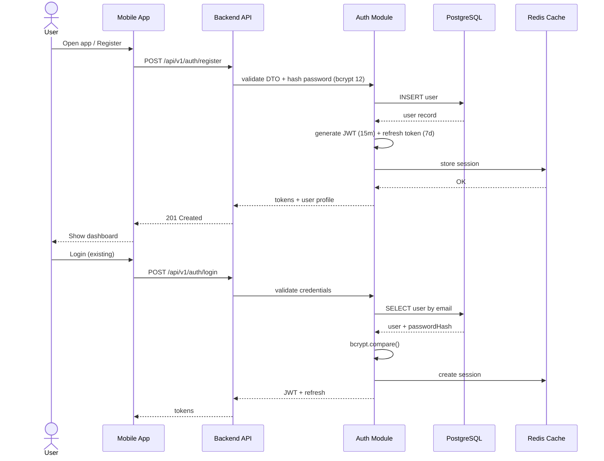

---

## 2. Garden Creation & Crop Planting

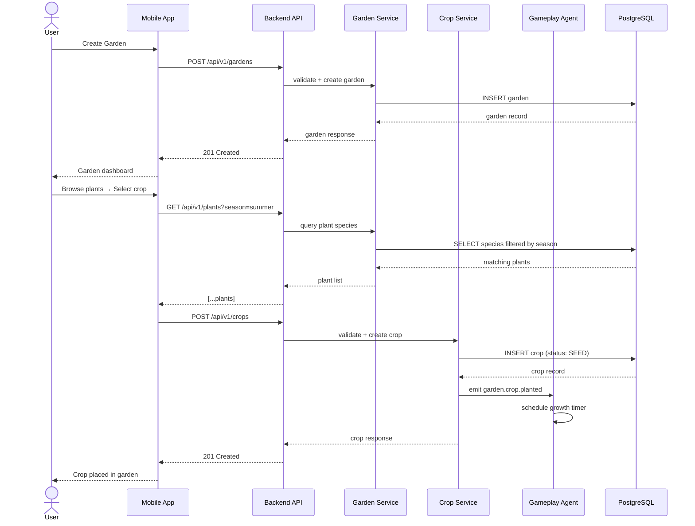

---

## 3. Crop Growth Cycle (Event-Driven)

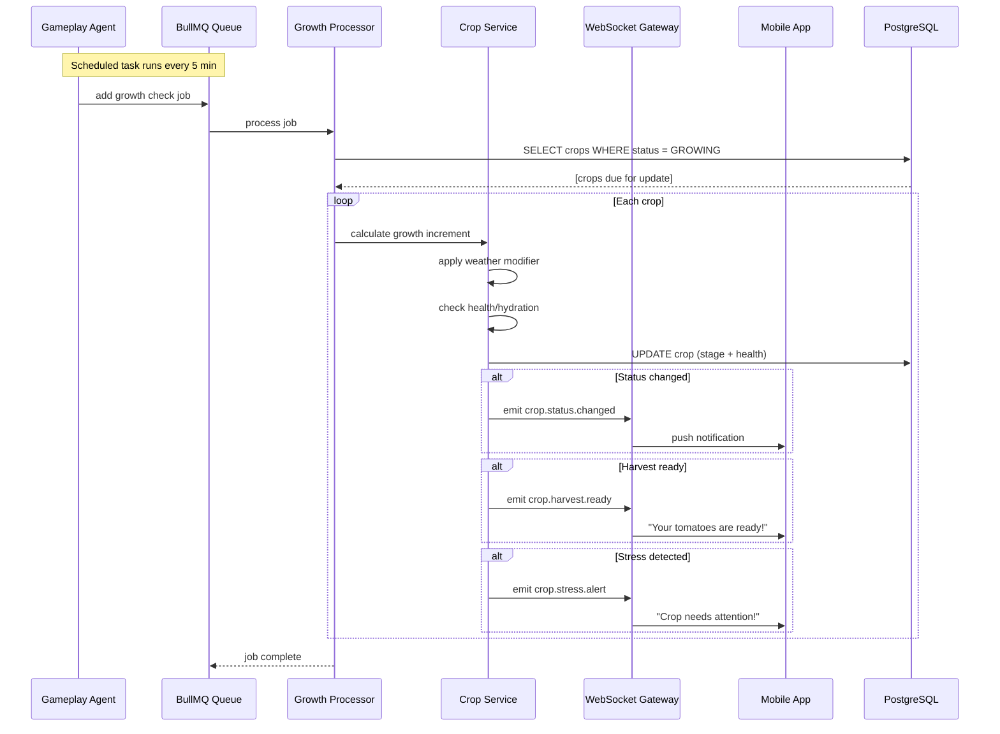

---

## 4. Weather Data Pipeline

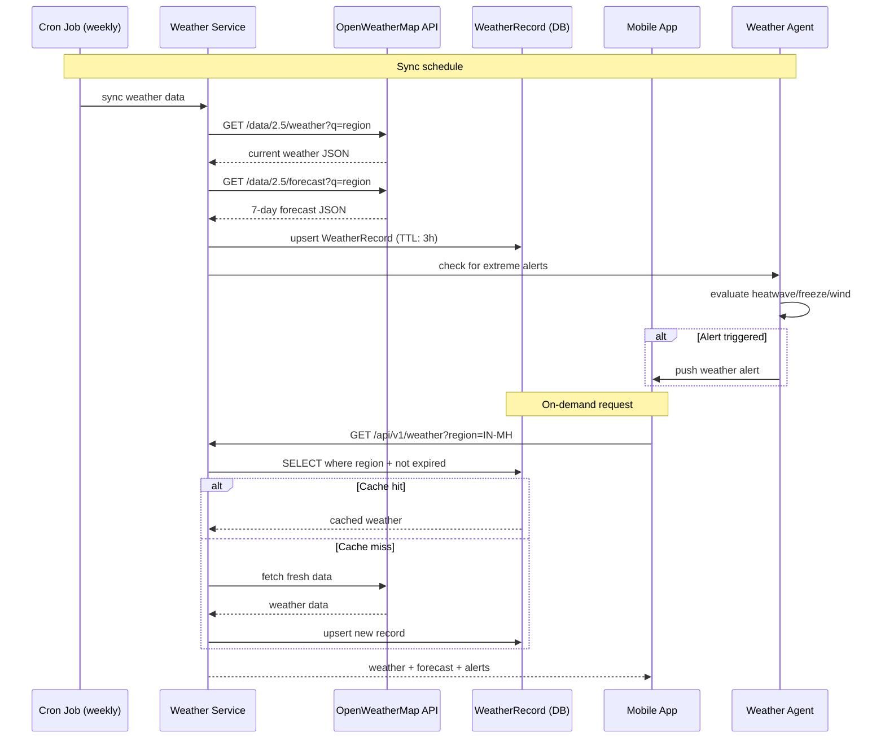

---

## 5. Plant Identification (AI Vision Pipeline)

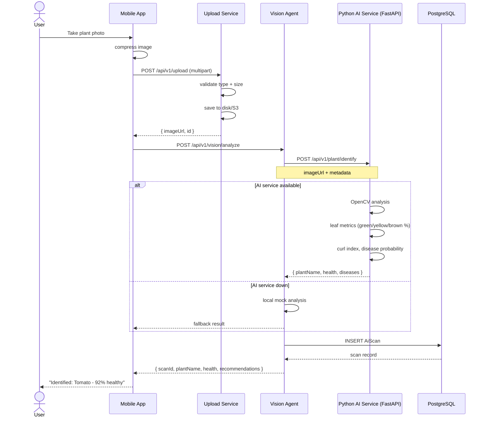

---

## 6. Marketplace Transaction

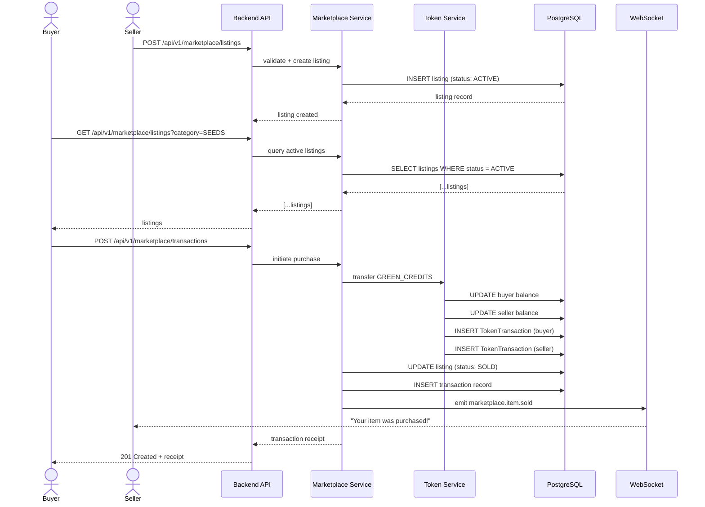

---

## 7. Community & Real-Time Chat

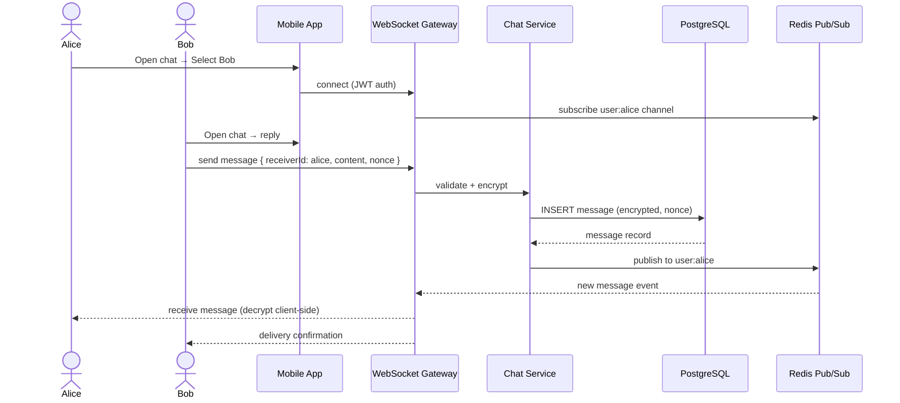

---

## 8. IoT Sensor Data Pipeline

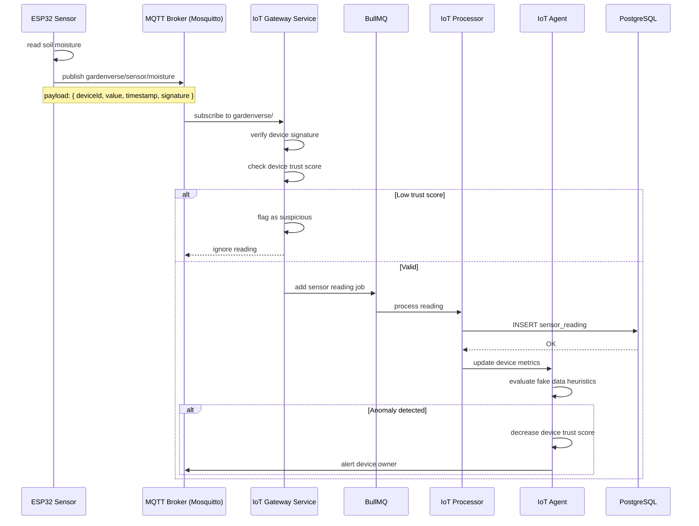

---

## 9. QR Invite System

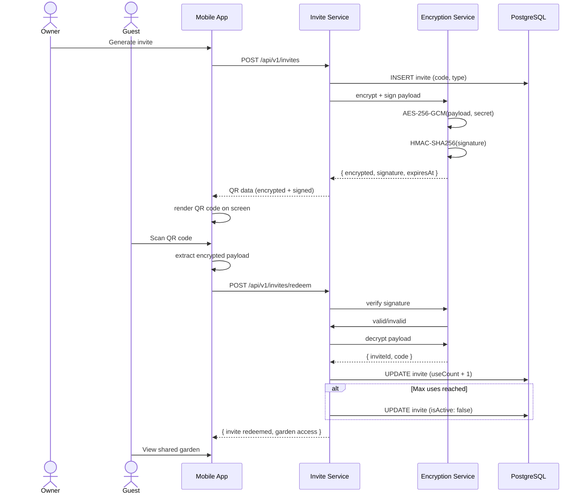

---

## 10. Admin Dashboard UX Flow

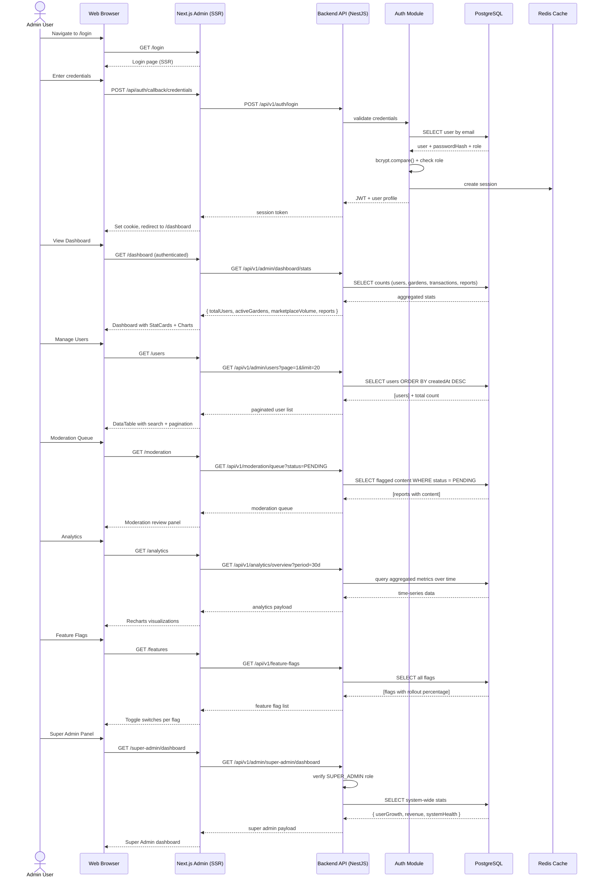

---

## 11. Cross-Module Event Flow (Agent Orchestration)

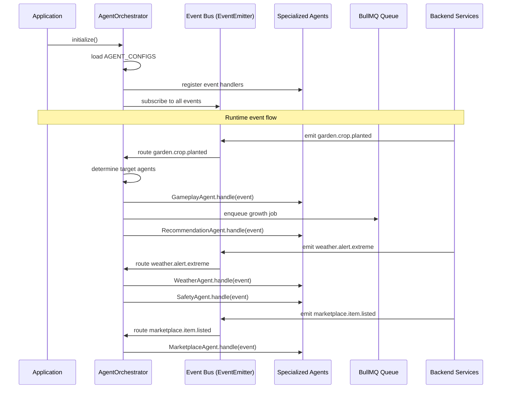
